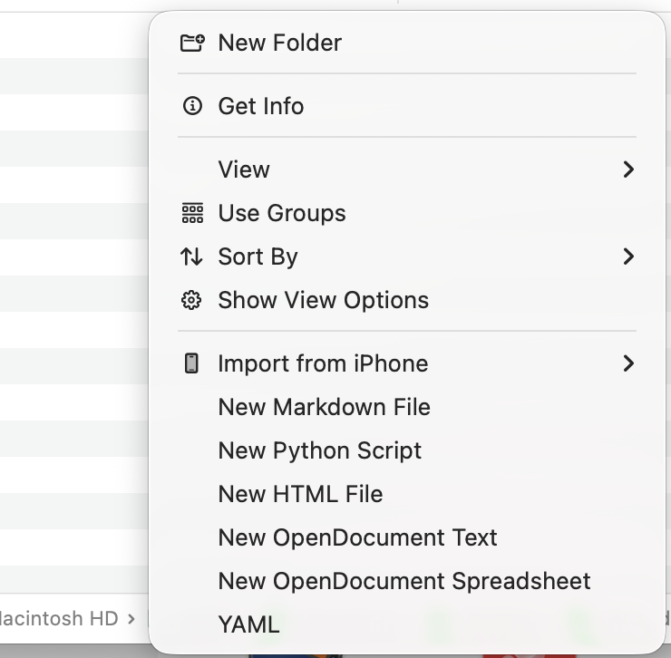

# Finder File Creator

Finder File Creator is a productivity utility for macOS 26+ (maybe works on older versions aswell if target is adjusted, but I could not test it) that adds a "New File" submenu directly to your macOS context menu. It allows you to instantly generate files from custom templates like Markdown, Python, or HTML in any directory.
